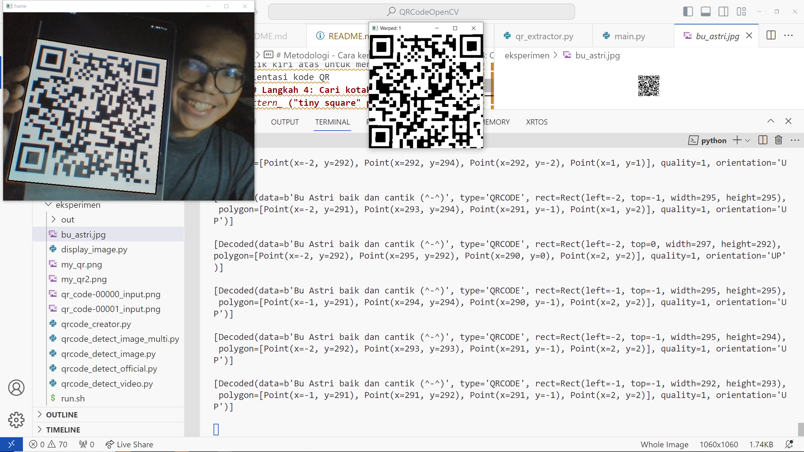

# QRCodeOpenCV

Menggunakan OpenCV Python untuk melakukan deteksi QRCode.

Repositori ini dibuat untuk memenuhi tugas Besar Mata Kuliah EL4125 Pengolahan Citra Digital.

Untuk melihat *implementasi algoritma*, pergi ke folder `pengembangan`

**Anggota**

- Jefferson Grizzlie (13220013)
- Bostang Palaguna (13220055)

**Pranala**

[OneDrive Proyek](https://itbdsti-my.sharepoint.com/:f:/g/personal/13220055_mahasiswa_itb_ac_id/EqE_cp7pZGBDn7WStm3Gpy0BFunAwgUtS5my3luA5QMLzQ)

[PPT Presentasi](https://docs.google.com/presentation/d/1QgyVbHJYDaKuFzFAYUvRzN4ykth1HhrROXFHa08yMo4/edit#slide=id.g33a222761babc227_0)

[Referensi Implementasi](https://github.com/MikhailGordeev/QR-Code-Extractor/tree/master)

**Pengujian**

